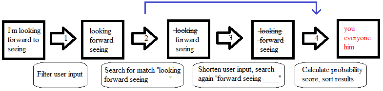
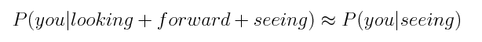
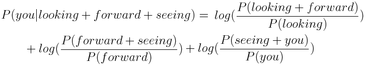
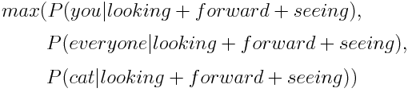

# Data Science Capstone Project: A Text Prediction Algorithm built with the SwiftKey Dataset
This README file describes the algorithm and all files necessary to satisfy the shinyApps requirement for the Data Science Capstone final project.

### Project Requirements
The goal of this exercise is to create a product to highlight the prediction algorithm that you have built and to provide an interface that can be accessed by others. For this project you must submit:

1. A Shiny app that takes as input a phrase (multiple words) in a text box input and outputs a prediction of the next word.
2. A slide deck consisting of no more than 5 slides created with R Studio Presenter pitching your algorithm and app as if you were presenting to your boss or an investor.

**This repository contains all the files necessary to satisfy the shinyApps requirement**

### SwiftKey Data
The data is from a corpus called HC Corpora (www.corpora.heliohost.org). See the readme file at http://www.corpora.heliohost.org/aboutcorpus.html for details on the corpora available. The files have been language filtered but may still contain some foreign text. In this capstone we will be applying data science in the area of natural language processing. The data used for this project can be accessed [here](https://d396qusza40orc.cloudfront.net/dsscapstone/dataset/Coursera-SwiftKey.zip)

### Text Prediction Flowchart

Below you can see a flowchart for the text prediction algorithm deployed on the shiny apps website. One key aspect is the utilization of "Stupid Backoff" approach. Specifically, at Step 2 in the flow chart, if a match is not found we will shorten the user input in Step 3 and search again to increase the likelihood a match is found. This also requires we add a penalty to the final probability. For our implementation we add log(0.4) to the final probability.

- Step 1: We begin with user input and filter it to remove profanity, punctuation, contractions, numbers, foreign characters, common words, and any extra white space.
	+ If the user enters "I am looking forward to seeing the" the algorithm will use "looking forward seeing" 
- Step 2: Search for a match, "looking forward seeing _____"
	+ If sufficient number of matches are found, skip to Step 4
- Step 3: If more matches are needed we shorten user input and search again
	+ "looking forward seeing _____" >>> "forward seeing _____"
- Step 4: Calculate probability scores for matches, add penalty if necessary
	+ Log probability is employed to increase algorithm speed

### Calculating Probability Score
The image below shows a conventional method for calculating the probability of a sentence. For our purposes the equation will be slightly different as we wish to predict the next word.

In order to predict the next word we begin with the left hand side of the equation below. This statement reads the probability of 'you' given 'looking forward seeing'. The full equation below employs a Markov assumption. Under this assumption we can reduce the computational complexity of algorithm.

The equation below shows the model used to calculate a probability score for each predicted word. Multiplication is replaced with addition since we are using log probability. In the event the "Stupid Backoff" was employed we also must add a penalty of log(0.4) to the probability score. A penalty of log(0.4) is added to the probability score each time the sequence is shortened.

If multiple matches are found for a sequence we rank them based on scores calculated from the above equation. If only one word is necessary to return we can use the equation below.

### Algorithm Rationale
Key considerations for algorithm design:

- "A key point here is that the predictive model must be small enough to load onto the Shiny server. So pay attention to model size when creating and uploading your model." 

- "When you type a phrase in the input box do you get a prediction of a single word after pressing submit and/or a suitable delay for the model to compute the answer?"

Based on these requirements we chose a model based on existing NGrams. For a long piece of text we shorten the user input to the last three words and use the 4-gram table. These tables (1,2,3,4 gram) are loaded from a .txt file prior to execution of the algorithm. The file ‘createFilteredTables.R’ shows how the raw data files are transformed into N-Gram tables.

This is choice was made to increase the speed of the algorithm and to reduce memory usage. It is possible that using a machine learning method with an unseen sequence of text would cost extra computational memory and time. If the user provides random text to this prediction algorithm "awpu1iub325  i1398th351bvnnd  qwliwiu2451" we simply return the most common unigrams. In this manner we avoid using extra memory while quickly returning a result.

### Repository Files
- createFilteredTables.R: this file takes the raw data and creates the file 'NGramSortedFinal.txt'
	+ this file uses the files in the 'functions' folder
- profanity.RData: a list of words to remove
- NGramSortedFinal.txt: contains four concatenated tables and the associated NGram counts
- divideNGram.RData: contains positions used to divide the table (from NGramSortedFinal.txt) into look up tables
	+ NGramSortedFinal.txt and divideNGram.RData are used to load and divide the tables used for searching for a match.
- getPredWord.R: this is the main function called by server.R for the application interface
	+ This file searches for matches based on the user input, implements "Stupid Backoff" if necessary, and calculates a penalty for the probability score
- global.R: loads the lookup tables to search for matches, loads additional libraries and functions
- server.R: code necessary to access user input, calls functions necessary to predict the next word, and return results to the user interface 
- ui.R: code necessary for the application interface
	+ Input: Text box that accepts a phrase, a drop down menu which sets the maximum number of words returned, and an "Analyze Text" button which initiates the algorithm 
	+ Output: The original phrase, a filtered phrase that is provided to the algorithm, and a table that returns the predicted words

### Shiny App
Click [https://jdtcob.shinyapps.io/project/](https://jdtcob.shinyapps.io/project/) to view the working application.